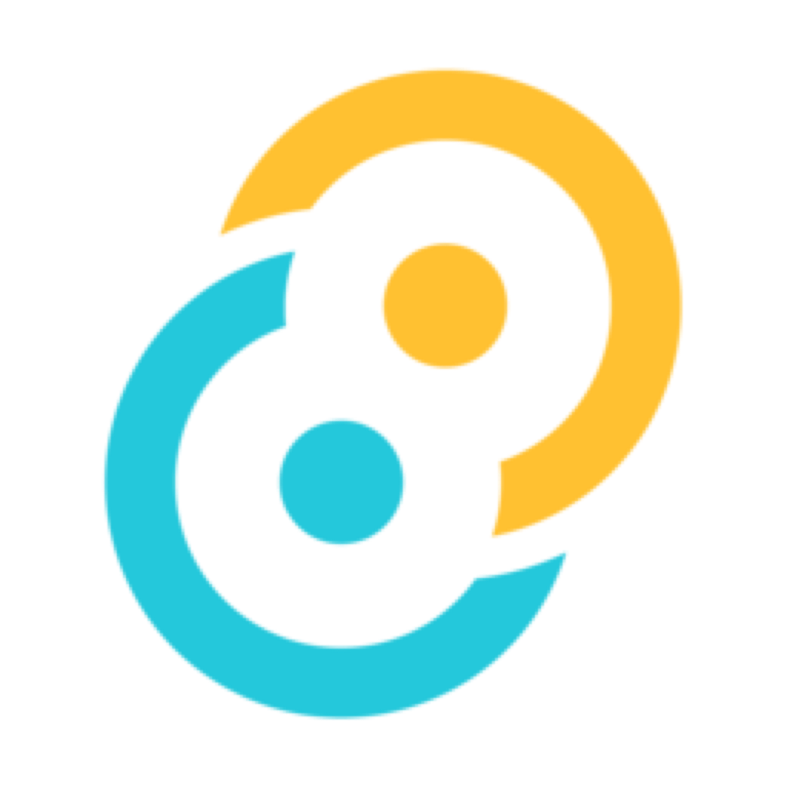

  

<h1 align="center">Opsnook</h1>

  <b>A calm command center for every AI coding agent — in your Mac's notch.

  <a href="https://opsnook.com">opsnook.com</a> · Mac App Store · macOS 14+ · Swift 6 · 100% local

---

You're running Claude Code in one terminal, Codex in another, maybe TRAE or Qoder in an IDE. Each one is a black box: is it still working? Stuck waiting for a permission? Done ten minutes ago? You alt-tab in circles, and every minute an agent sits waiting on you is a minute wasted.

Opsnook lives in your Mac's notch and watches all your agents at once. One glance tells you who needs you. One click approves, denies, or jumps you back. Quiet until it matters.

  

https://github.com/user-attachments/assets/24016373-115b-4575-9272-d4c0bdffc132

> Full screenshots and a product tour are at [opsnook.com](https://opsnook.com).

## Features

- **7 agents, one panel** — monitors Claude Code, Codex, Antigravity, ZCode, WorkBuddy, TRAE SOLO, and Qoder side by side, with running and pending work grouped by urgency.
- **6 normalized states** — every agent's activity maps to the same vocabulary: needs approval / waiting for input / error / running / done / idle. The notch pill always shows the highest-priority state at a glance.
- **One-click approvals for Claude Code** — allow or deny permission requests right from the notch panel, no window switching. Decisions flow back to Claude through a blocking hook — a real approval channel, not a notification.
- **Session timeline viewer** — a swimlane console that replays a whole session: user input, tool calls, searches, file reads/edits, commands, git and network activity — even subagent forks get their own lanes. Filter by event type, search, zoom, and switch between horizontal and vertical layouts.
- **Usage & cost tracking** — today / 7-day token counts and estimated spend, broken down per agent.
- **Workspace view** — uncommitted changes and branch status for the projects your agents are working in.
- **Click to jump back** — any session row focuses the right app instantly.
- **Native macOS** — notch UI that collapses to a slim pill and expands on hover or <kbd>⌥⌘H</kbd>, multi-display support, focus mode, English / 中文.
- **100% local** — Opsnook reads agent sessions from your disk. Zero prompts, commands, paths, or logs ever leave your Mac. No account, no cloud.

## Supported agents

| Agent | Vendor | Integration |
|---|---|---|
| Claude Code | Anthropic | Full: status, timeline, usage, **in-panel approvals** |
| Codex | OpenAI | Status, timeline, usage |
| Antigravity | Google | Status monitoring, timeline |
| TRAE SOLO | ByteDance | Status monitoring, timeline |
| Qoder | Alibaba | Status monitoring, timeline |
| WorkBuddy (CodeBuddy) | Tencent | Status monitoring, timeline |
| ZCode | Z.ai | Status monitoring, timeline |

Desktop and CLI variants of the same agent are detected and distinguished automatically.

## Requirements

- macOS 14 or later (best on a Mac with a notch; a virtual notch is drawn on external displays)
- The agents you want to monitor, installed and used locally

Opsnook is a sandboxed Mac App Store app. On first launch you grant read access to each agent's data directory (and optionally your workspace roots) via standard folder-permission dialogs — access is scoped, revocable, and read-only.

## Privacy

Everything stays on your Mac. Opsnook parses local session files inside the App Sandbox using user-granted, security-scoped bookmarks. It uploads nothing — no prompts, no commands, no file paths, no logs.

## Contact

Questions or feedback: [opsnook@outlook.com](mailto:opsnook@outlook.com) · [opsnook.com](https://opsnook.com)
